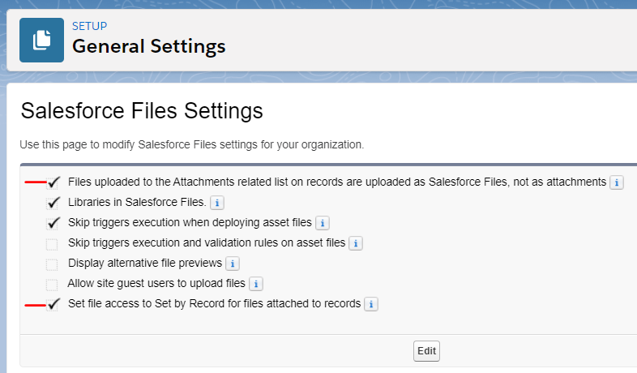

# Controlled Document Tracker (CDT)

A workflow application to assist federal agencies manage controlled correspondence.

## Pre-Deployment

Following steps are necessary for deployment of CDT source:

1. Create 'CDT Business Hours' Business Hours entry under setup and set it as Active.
2. Turn on Email Deliverability setting to 'All Emails', this is required for some test classes to pass.
3. Enable Chatter

## Post-Deployment

1. Create an Org-wide email address, which will be used for default emails display name. (example,
donotreply@some.org)
    Set the Id of this Org-wide email address record, under 'CDT Org Address's 'OrgEmail' custom metadata record.
1. Page layout assignments needs to be adjusted for Controlled Document Object.
1. Modify custom labels - 'CDT Error', 'CDT File Deletion Request', 'CDT Issue Controls' as necessary.  
Change 'Admin' text to proper email.
1. Under Custom Settings, Open 'CDT GSA Administrator' custom setting and modify 'Agency Administrator' record's FullName to appropriate user.
1. There are 2 Scheduleable classes (GrantAccessToChatterFileBatchSchedule, ScheduleUpdateDaysOpenOnApprovalSteps) which are required to be running for proper working functionality.  GrantAccessToChatterFileBatch needs to run every 1 minute, and ScheduleUpdateDaysOpenOnApprovalSteps can be run nightly @3am.
1. Set files settings as shown

